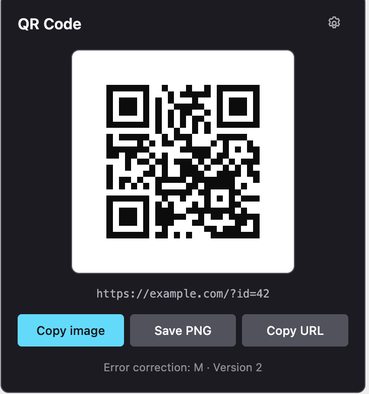
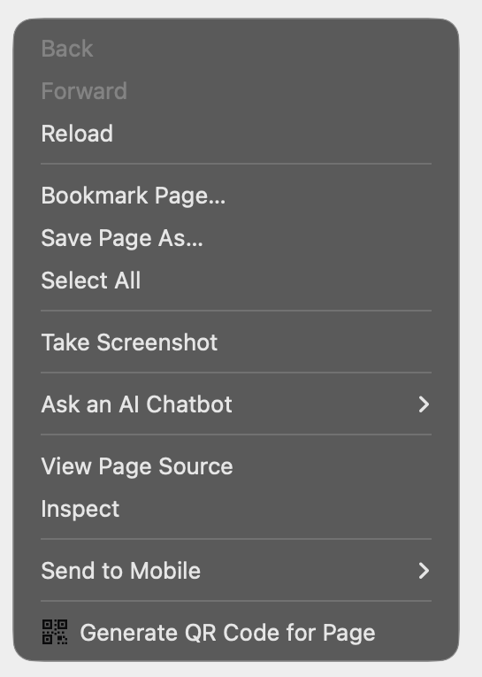
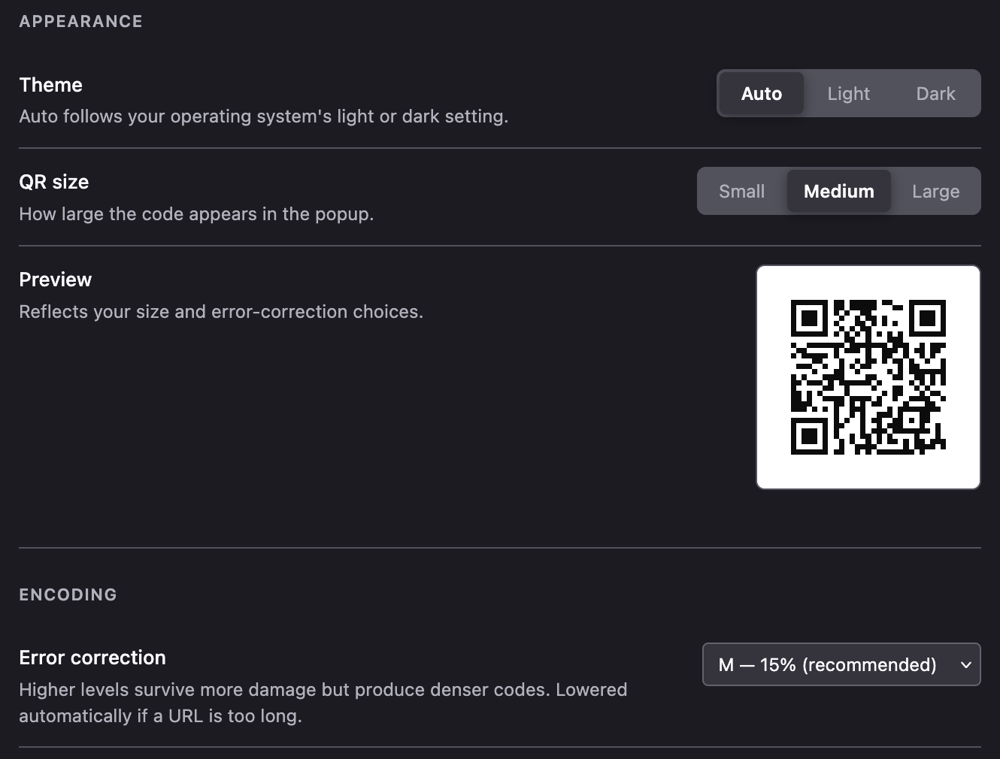
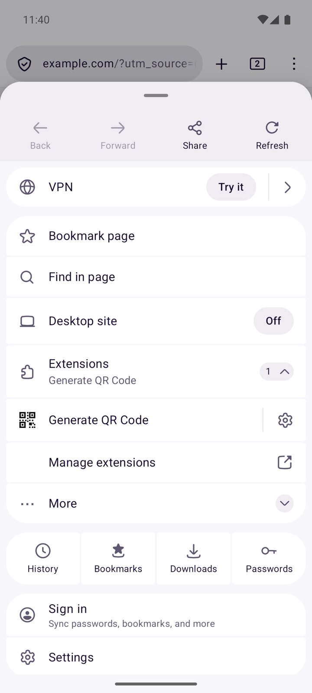
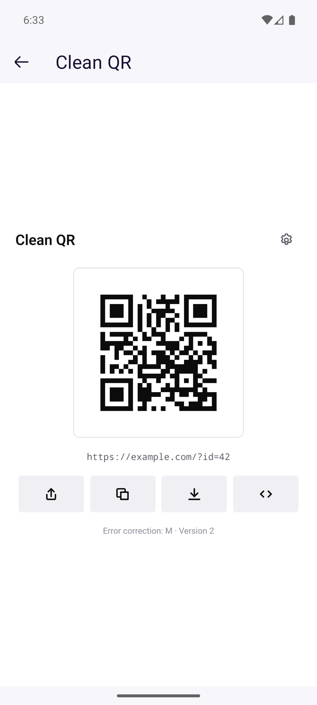

# Clean QR for Firefox

Generates a QR code for the current page, a link, an image, or selected text — then
strips the tracking parameters out of it first. Runs entirely offline; nothing is ever
sent to a server.

Works on Firefox desktop (macOS, Windows, Linux) and Firefox for Android.

## Screenshots

### Firefox desktop

| Popup | Context menu |
| --- | --- |
|  |  |

### Firefox for Android

| Popup | Browser menu | Settings |
| --- | --- | --- |
|  |  |  |

One shared UI: a 360px panel anchored to the toolbar button on desktop, a full-window
overlay on Android. Android gains a Share button because Fenix ships the Web Share API;
desktop Firefox does not, so it is simply absent rather than disabled. In every shot the
page was loaded with `?utm_source=newsletter&id=42` and the code encodes
`https://example.com/?id=42`.

## What it does

**Cleans the URL first.** `utm_*`, `fbclid`, `gclid`, `mc_*` and around forty others are
removed before encoding, so the link that opens on the other device is the one you meant
to share. A shorter URL also produces a sparser code, which scans more easily.

**Types what you selected.** Select a phone number, email address or coordinate pair and
the code becomes `tel:`, `mailto:` or `geo:` — something the scanning phone offers to act
on rather than inert text. Detection is deliberately reluctant: prices, dates, version
numbers, ISBNs and part numbers are all left alone, because a wrong guess is worse than
plain text. The raw words are always offered alongside, never replaced.

Numbers written without a country code — `918-555-4351` — are read on their grouping, so
they have to be three digits, three digits, four, with neither the area code nor the
exchange starting in 0 or 1. That is narrow enough to keep reference numbers and ISBNs
out. Set a country code in Settings to have one added, or leave it blank and let the
scanning phone resolve the number where it is.

**Links to the passage, not just the page.** Selecting text also offers a
[text fragment](https://developer.mozilla.org/en-US/docs/Web/URI/Reference/Fragment/Text_fragments)
link that scrolls the reader to that passage. Long selections encode only their first and
last few words, which matches the same text while keeping the code far sparser.

**Lets you overrule it for one code.** Cleaning and selection typing are both good
defaults and occasionally wrong — a URL whose parameters matter, a phone number you
wanted as plain digits. Switches under the buttons turn each off for the code in hand
without changing the setting for every code after it, and each appears only where it
would actually change something.

**Keeps the code scannable.** Error correction is lowered automatically rather than
letting a long URL produce a dense code a phone camera struggles with off a screen — and
the footer says so instead of changing your setting silently.

## Surfaces

| | Desktop | Android |
| --- | --- | --- |
| Toolbar button + popup | yes | yes |
| Context menu (page/link/image/selection/frame) | yes | no — Fenix has no `menus` API |
| Windows/Linux shortcut (`Alt+Shift+Q`) | yes | no |
| macOS shortcut (`Option+Shift+Q`, ⌥⇧Q) | yes | no |
| Share to the OS share sheet | no — no Web Share | yes |
| Copy image to clipboard | yes | yes |

Platform differences are resolved by feature detection rather than user-agent sniffing,
so the UI adapts as Firefox for Android gains APIs.

## Permissions

| Permission | Used for |
| --- | --- |
| `activeTab` | Reading the current tab's URL and title when you invoke the extension |
| `menus` | The right-click entries |
| `storage` | Persisting your settings |
| `clipboardWrite` | Copy image, copy URL, copy Markdown, and auto-copy on open |

`clipboardWrite` is the only one that prompts on install. It is required rather than
optional: clipboard writes from an extension page need transient user activation without
it, so auto-copy-on-open — which fires with no click behind it — would silently fail.

Notably absent:

- **`downloads`** — would add a warning, and was removed from Firefox for Android in
  Fenix 79. Saving uses an object-URL `<a download>` instead.
- **`scripting`** and **host permissions** — nothing is ever read from the page. The
  context menu already provides the selection and the page URL.
- **network access** — there is none. The QR code is generated on your machine.

## Settings

Beyond theme, size and error correction, the options page covers which context-menu
entries appear, which extra popup buttons are shown, how a selection is offered by
default, text-fragment precision, the country code for local phone numbers, extra tracking
parameters of your own, whether recent codes are remembered, and the file-naming scheme.

**Recent codes is off by default.** It records what you encoded, which is browsing history
by another name — so it is opt-in, capped, cleared when you switch it off, and never
written from a private window.

## Theme

Follows the operating system's light/dark setting by default; Settings offers **Auto /
Light / Dark**, and an explicit choice overrides the OS in both directions. The toolbar
icon ships in two inks so it stays legible on a dark toolbar.

The QR code itself always renders dark-on-white regardless of theme — an inverted or
low-contrast code is a well-known scanner-failure mode, so the theme is not permitted to
reach it.

## Development

Running it locally, the source layout and the release process are all in
[DEVELOPMENT.md](DEVELOPMENT.md). There is no build step: the extension ships as plain
unbundled, unminified ES modules, so what runs in the browser is what is in this repo.

## License

MIT — see [`LICENSE`](LICENSE).

The vendored QR library, `qrcode-generator` by Kazuhiko Arase, is separately MIT licensed
and redistributed unmodified; its notice is at `src/vendor/LICENSE`.
